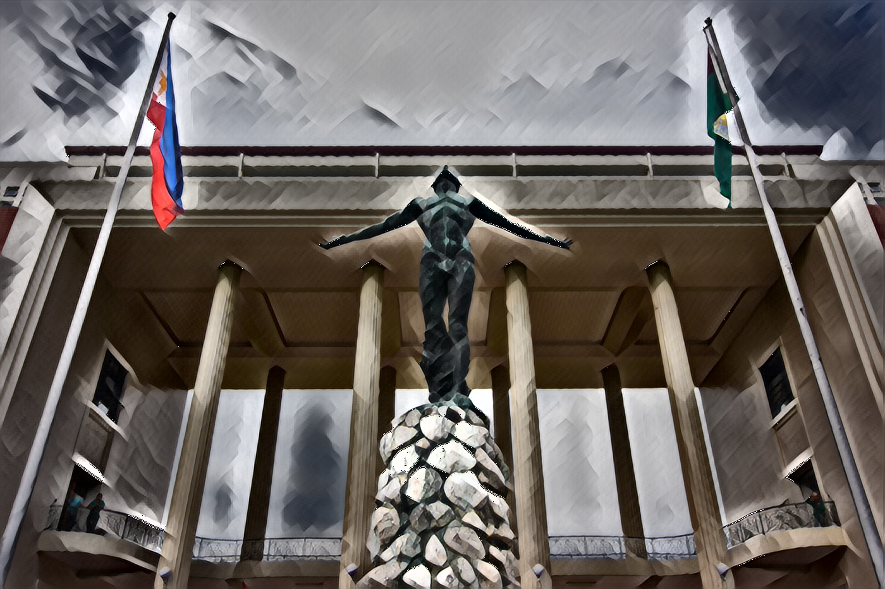

## Team Introduction
최정우(CHOI JUNG WOO)_202211388_Project Director

## Topic Introduction
- 개요

  이 프로그램은 이미지 스타일 변환(fast-neural-style-transfer)을 수행하는 것을 목표로 합니다. 
  
  스타일 변환은 하나의 이미지의 스타일을 다른 이미지에 적용하여 새로운 이미지를 생성하는 작업입니다. 이 프로그램은 사전 훈련된 변환 네트워크를 사용하여 이미지의 스타일을 변환하고, 결과 이미지를 저장합니다.
  
  
  이 프로그램은 다음과 같은 기능을 제공합니다:
  
  - train.py: 스타일 변환 네트워크를 학습시키는 기능으로, 주어진 스타일 이미지를 기반으로 변환 네트워크의 가중치를 조정합니다.
  
  - stylize.py: 단일 이미지나 이미지 폴더에 스타일을 적용하는 기능으로, 사전 훈련된 변환 네트워크를 사용하여 이미지를 스타일링합니다.
  
  - video.py: 비디오 파일에서 프레임을 추출하고, 추출한 프레임에 스타일을 적용하여 새로운 비디오를 생성하는 기능입니다.
  
  - webcam.py: 웹캠에서 실시간으로 비디오를 캡처하고, 캡처된 프레임에 스타일을 적용하여 화면에 출력하는 기능을 제공합니다.
 
  이 프로그램을 사용하면 스타일 전이를 쉽게 수행하고 이미지와 비디오에 다양한 스타일을 적용할 수 있습니다.
  
  
## Results
### stylize.py
  
    - up-diliman.jpg 원본

  
  
  - STYLE_TRANSFORM_PATH = "transforms/udnie.pth"일 경우

  
  
  - STYLE_TRANSFORM_PATH = "transforms/mosaic.pth"일 경우

  
  
  - STYLE_TRANSFORM_PATH = "transforms/tokyo_ghoul.pth"일 경우

 
  
  - STYLE_TRANSFORM_PATH = "transforms/wave.pth"

  
  
### video.py 

 
  
### webcam.py 

  - STYLE_TRANSFORM_PATH = "transforms/mosaic.pth"일 경우

  
  
  - STYLE_TRANSFORM_PATH = "transforms/tokyo_ghoul.pth"일 경우
 
  
  
  - STYLE_TRANSFORM_PATH = "transforms/wave.pth"
 
  
  
  - STYLE_TRANSFORM_PATH = "transforms/starry.pth"
   

## Analysis/Visualization

## Installation

### Requirements
Most of the codes here assume that the user have access to CUDA capable GPU, at least a GTX 1050 ti or a GTX 1060

#### Data Files
* [Pre-trained VGG16 network weights](https://github.com/jcjohnson/pytorch-vgg) - put it in `models/` directory
* [MS-COCO Train Images (2014)](http://cocodataset.org/#download) - 13GB - put `train2014` directory in `dataset/` directory
* [torchvision](https://pytorch.org/) - `torchvision.models` contains the VGG16 and VGG19 model skeleton

#### Dependecies
* [PyTorch](https://pytorch.org/)
* [opencv2](https://matplotlib.org/users/installing.html)
* [NumPy](https://www.scipy.org/install.html)
* [FFmpeg](https://www.ffmpeg.org/) (Optional) - Installation [Instruction here](https://github.com/adaptlearning/adapt_authoring/wiki/Installing-FFmpeg)

  
